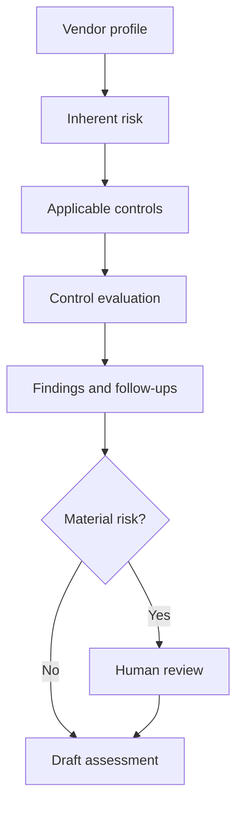

# AI Vendor Risk Assessment Agent
[](https://github.com/creativesolutions2013-debug/ai-vendor-risk-assessment-agent/actions/workflows/python-tests.yml)
A portfolio demonstration of an AI-ready, human-governed workflow for
evaluating third-party cybersecurity risks, evidence gaps, and remediation
requirements.

## Project Overview

Third-party security assessments often require analysts to manually review
vendor questionnaires, assurance documentation, control evidence, and
remediation commitments. This can lead to inconsistent assessments,
extended review cycles, and difficulty explaining how risk decisions were
reached.

This project demonstrates how structured automation and governed AI prompts
can help standardize the assessment process while preserving human
accountability for material risk decisions.

## What the Workflow Does

The current prototype:

- Loads a fictional vendor security profile
- Evaluates the vendor against a defined control library
- Determines a preliminary inherent-risk rating
- Distinguishes implemented, partial, planned, and missing controls
- Identifies security control gaps
- Generates risk statements and recommendations
- Produces a Markdown assessment report
- Escalates high-risk decisions for human review
- Documents limitations and prevents autonomous risk acceptance

## Demonstrated GRC Capabilities

- Third-Party Risk Management
- Inherent and residual risk assessment
- Control applicability analysis
- Security evidence evaluation
- Risk-statement development
- Remediation planning
- Human-in-the-loop governance
- Responsible AI safeguards
- Auditable assessment outputs

## Architecture



For the complete workflow, see
[Architecture and governance design](docs/architecture.md).

## Repository Structure

```text
ai-vendor-risk-assessment-agent/
├── app.py
├── controls/
│   └── control-library.csv
├── docs/
│   └── architecture.md
├── outputs/
│   └── sample-assessment.md
├── prompts/
│   ├── assessment-prompt.md
│   └── system-prompt.md
├── sample-data/
│   └── fictional-vendor.json
├── .gitignore
├── LICENSE
└── README.md
```

## Sample Scenario

The fictional vendor, NorthStar Analytics, provides a cloud-based customer
analytics platform and processes personal and confidential business
information.

The sample assessment identifies:

1. Lack of independent penetration testing
2. Absence of endpoint detection and response
3. Insufficient security-log retention
4. Partial subprocessor-risk management

Review the
[generated sample assessment](outputs/sample-assessment.md).

## Run the Prototype

### Requirements

- Python 3.10 or later
- No API key required for the deterministic assessment engine

### Execution

```bash
python app.py
```
Run the simulated provider-neutral AI layer:

```bash
python ai_layer.py
The application creates:

```text
outputs/sample-assessment.md
```

## Governance and Human Oversight

The workflow does not independently:

- Approve a vendor
- Accept a security risk
- Approve a compensating control
- Extend a remediation deadline
- Validate the authenticity of vendor evidence
- Accept high or critical residual risk

Those decisions require an authorized risk owner or qualified security
professional.

## AI Governance Controls

The prompt design requires the AI-assisted layer to:

- Use only supplied information and evidence
- Identify insufficient information instead of guessing
- Never invent evidence or control implementations
- Separate planned remediation from implemented controls
- Document uncertainty and assumptions
- Map findings to defined controls
- Escalate material decisions for human review
## Current Implementation

The project uses a hybrid assessment architecture:

1. A deterministic Python engine produces a repeatable baseline assessment.
2. A provider-neutral AI layer assembles governed prompts, vendor context,
   control requirements, and baseline findings.
3. A mock provider simulates the external model boundary without making
   network requests or requiring credentials.
4. Automated tests validate prompt completeness, control traceability,
   simulation labeling, and human-review requirements.
5. GitHub Actions regenerates both reports and runs all 12 tests after every
   code change.

The mock provider is intentionally labeled and must not be represented as a
production AI model. It can later be replaced by an approved provider that
implements the same interface.

Review the
[simulated AI-assisted assessment](outputs/ai-assisted-sample.md).

## Planned Enhancements

- Connect an approved LLM provider through the provider-neutral interface
- Add evidence-document ingestion
- Add retrieval from an approved control knowledge base
- Add automated follow-up-question generation
- Add structured JSON assessment output
- Add prompt and output evaluation tests
- Add a browser-based assessment interface
- Add reviewer approval and audit logging
- Add mappings to SOC 2, ISO 27001, NIST CSF, and PCI DSS

## Responsible Use

This project is a portfolio demonstration. AI-generated results may be
incomplete or inaccurate and must be validated by a qualified security
professional.

## Data and Confidentiality Disclaimer

All organizations, vendor information, evidence, findings, and data used in
this repository are fictional or synthetic.

This project contains no confidential information belonging to Amazon,
Clorox, NBCUniversal, any current or former employer, client, or third party.

## Author

**Francis D. Aboagye**

Governance, Risk, and Compliance professional specializing in third-party
risk management, security governance, control assurance, and AI-enabled GRC
workflows.

- [LinkedIn](https://www.linkedin.com/in/francis-a-1b66931a2)
- [LMA Creative Solutions](https://www.lmacreativesolutions.com/)