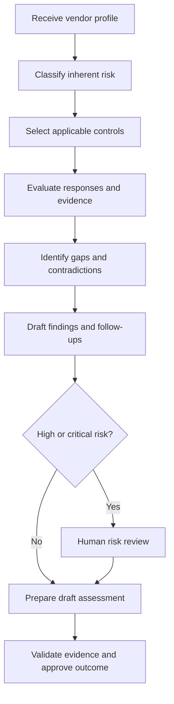

# AI Vendor Risk Assessment Agent Architecture

## Purpose

This project demonstrates how an AI-assisted workflow can accelerate
third-party cybersecurity assessments while preserving human accountability,
evidence traceability, and defensible risk decisions.

## Workflow

## Components

### Vendor profile

The fictional vendor profile contains:

- Service information
- Business criticality
- Data classifications
- System integrations
- Security questionnaire responses
- Remediation commitments

### Control library

The control library defines the security requirements used to evaluate the
vendor. Each control includes:

- Control identifier
- Security domain
- Requirement
- Risk severity
- Expected evidence

### System prompt

The system prompt establishes:

- The agent’s role
- Permitted and prohibited behavior
- Assessment statuses
- Required output
- Human-review requirements
- Anti-hallucination safeguards

### Assessment prompt

The assessment prompt instructs the agent to:

- Determine inherent risk
- Assess applicable controls
- Identify missing evidence
- Generate findings
- Recommend remediation
- Escalate material decisions

### Assessment output

The resulting report contains:

- Executive summary
- Inherent-risk rationale
- Control evaluations
- Security findings
- Evidence requests
- Follow-up questions
- Preliminary residual risk
- Human-review decisions

## Human-in-the-Loop Controls

The agent cannot independently:

- Approve a vendor
- Accept a security risk
- Approve a compensating control
- Extend a remediation deadline
- Determine that high-risk residual exposure is acceptable
- Confirm operating effectiveness without sufficient evidence

These decisions must be performed by an authorized risk owner or qualified
security professional.

## Data Flow

1. The vendor profile and control library are loaded.
2. Applicable control requirements are selected.
3. Vendor responses are evaluated against those requirements.
4. Missing evidence and control weaknesses are identified.
5. Findings and follow-up questions are drafted.
6. High-risk matters are routed for human review.
7. The reviewer validates evidence and approves the final assessment.
8. Open findings remain tracked until remediation is verified.

## Responsible AI Principles

- Use synthetic data in demonstrations
- Require evidence-backed conclusions
- Document uncertainty
- Prevent invented facts or evidence
- Maintain traceability to control requirements
- Separate planned controls from implemented controls
- Require human approval for material decisions
- Retain an auditable record of assessment outputs

## Current Limitations

- The demonstration uses a limited sample control library.
- AI-generated conclusions may be incomplete or inaccurate.
- Uploaded evidence is not independently authenticated.
- Framework mappings require professional validation.
- The project is not a substitute for a formal risk assessment.
